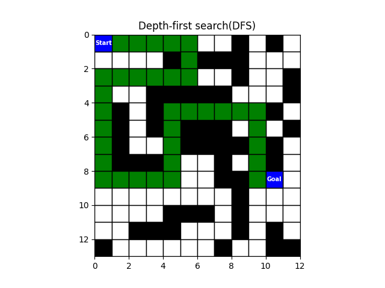

# Pathfinding-Algorithms-for-Robot-Navigation-on-Discrete-Maps

This project provides an implementation of four pathfinding algorithms for robot navigation on discrete maps. The algorithms included are:

1. Breadth-First Search (BFS)
2. Depth-First Search (DFS)
3. Dijkstra's Algorithm
4. A* Algorithm

## Files Included

- `main.py`: This script is the entry point of the program. It calls the load map function, all the search functions, and the visualize path function.
- `pathfinding.py`: This script contains the implementation of the four pathfinding algorithms.
- `pathfinding_utils.py`: This script provides the necessary utility functions required for the pathfinding algorithms.
- `map.csv`: This CSV file represents the map used for testing the algorithms. You can modify this file to create your own map by using 1 for obstacles and 0 for free space.

## Instructions to Run the Code

To run the code and test the pathfinding algorithms, follow these steps:

1. Clone the repository to your local machine.
2. Edit the `map.csv` file to create your own map. Use 1 to represent obstacles and 0 to represent free space.
3. Run the `main.py` script. This will execute all the search algorithms and visualize the paths on the map.

## Usage

After running the code, you will see the map displayed with the start and goal positions marked. The algorithm will then compute the path using each of the four algorithms and display the results.

The output will show the number of steps it took to find the path, the final path, and the length of the shortest path for each algorithm. The visualized path will be marked on the map as well.

Feel free to experiment with different maps and compare the performance of the different algorithms in terms of path length and computation time.

## Results

Below are the results for each algorithm:

### Breadth-First Search (BFS)

### Depth-First Search (DFS)

### Dijkstra's Algorithm

### A* Algorithm

Terminal Output:

Feel free to experiment with different maps and compare the performance of the different algorithms in terms of path length and computation time.

## Conclusion

This project provides a practical implementation of four common pathfinding algorithms for robot navigation on discrete maps. By running the code and modifying the map, you can observe the behavior and performance of each algorithm.
